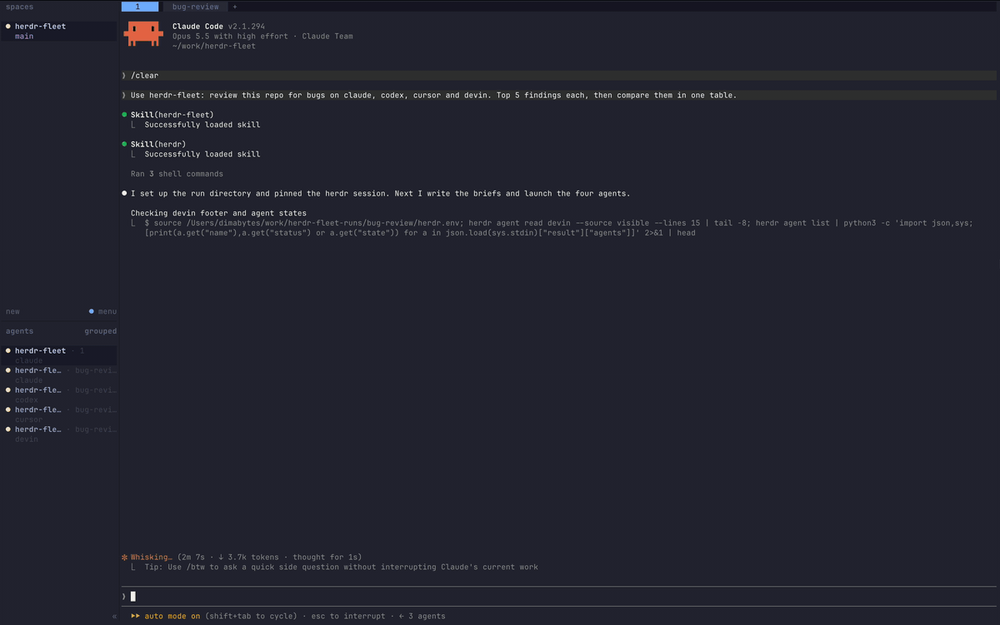

# Herdr Fleet

Run several coding agents in parallel [Herdr](https://herdr.dev/) panes under one orchestrator. Herdr is a terminal multiplexer for coding agents. This repo is an agent skill: a `SKILL.md` with scripts that teaches your agent (Claude Code, Codex, and others) a new workflow.

It works with any mix of the agent CLIs Herdr supports (Claude, Codex, Cursor, Devin, and others); you only need the ones you have installed.
Use it to split a big research task, fan out a review, or cross-check one question on different models.

Agents report through files, not chat. Background watchers wake the orchestrator when a report is final.



## Requirements

- macOS or Linux. Windows is not supported: the scripts are zsh.
- [Herdr](https://herdr.dev/), `zsh`, `python3`
- Node.js 18+ for the [Skills CLI](https://github.com/vercel-labs/skills) (`npx skills`)
- at least one agent CLI that Herdr supports, installed and logged in

## Install

```bash
npx skills add herdrdev/herdr -g --skill herdr # official Herdr skill, the fleet loads it first
npx skills add Dimabytes/herdr-fleet -g --skill herdr-fleet
```

## Quickstart

1. Run `herdr` in your project, then start your agent in a pane (for example `claude`).
2. Ask it: "use herdr-fleet: review this repo on claude-opus, codex-sol and cursor-grok, then compare the reports".
3. On first launch the skill creates `.herdr-fleet.config.json` in the project root. Edit it to keep only your agents.

> [!WARNING]
> Fleet agents usually run with auto-approve: cursor `--force` (in the example config), devin `--permission-mode bypass`, command-code `--yolo`. No approval prompt stops these agents before a destructive command. The skill gives each agent a no-destruction rule, but it is an instruction, not a sandbox. Remove these flags if you do not accept that risk.

## Agents

The skill does not hardcode models. It reads `.herdr-fleet.config.json` in the project root, so each project has its own agents.
On first launch in a project the skill copies [`herdr-fleet.config.example.json`](skills/herdr-fleet/herdr-fleet.config.example.json) there. It has one entry per model (claude opus and sonnet, codex luna, sol and astra, cursor grok and composer). Keep only the agents you have installed.

Model ids drift. `scripts/models.sh` asks each installed CLI for its live model list: use it to fix a stale id. `MODEL=<id> launch.sh ...` overrides the model at launch time. You can also launch a bare kind (`launch.sh <name> <pane> codex`) with no config entry at all.

```json
{
  "agents": {
    "codex-sol": {
      "kind": "codex",
      "model": "gpt-6.1-sol",
      "args": ["--approve-for-me"],
      "notes": "Workhorse for coding and careful analysis, long single-task runs."
    }
  }
}
```

| Field   | Meaning                                                  |
| ------- | -------------------------------------------------------- |
| key     | agent name you use in chat: "run it on codex-sol and cursor-grok" |
| `kind`  | `herdr agent start --kind` value, or `command-code` (headless `cmd -p` per task, see [SKILL.md](skills/herdr-fleet/SKILL.md)) |
| `model` | passed as `--model <model>`; omit for the CLI default |
| `args`  | extra CLI args, one array item per argv item. Permissions: the CLI's classifier mode if it has one (claude `--permission-mode auto`, codex `--approve-for-me`), otherwise full auto-approve |
| `notes` | what it is good at; the orchestrator picks agents by it  |

## Scripts

| Script      | What it does                                                         |
| ----------- | -------------------------------------------------------------------- |
| `models.sh` | list the live model ids of each installed agent CLI |
| `launch.sh` | start an agent (config entry or bare kind, optional `MODEL=`) in a pane, cwd = run dir |
| `prompt.sh` | send a task or follow-up; flushes the queued-message Enter some agents need       |
| `watch.sh`  | background watcher: exits on `Status: FINAL`, idle, blocked, gone, timeout (raises a herdr notification) |
| `command-code-run.sh` | runs one headless `cmd -p` task inside a command-code agent's pane |
| `collect.sh` | run index: every agent's report status in `index.md`; exits 0 only when all are FINAL |
| `cleanup.sh` | dry run by default; `--close` stops a run's processes and closes its panes |
| `grid.py`   | tiles a run's panes into an even grid (max 10 per tab) |
| `session.py` | finds the orchestrator's own herdr session and pane by cwd, pins it in `$R/herdr.env`; the other scripts load it |

## License

MIT — see [LICENSE](./LICENSE).
